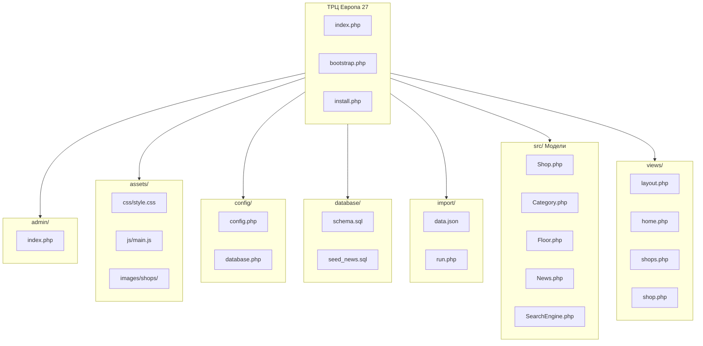
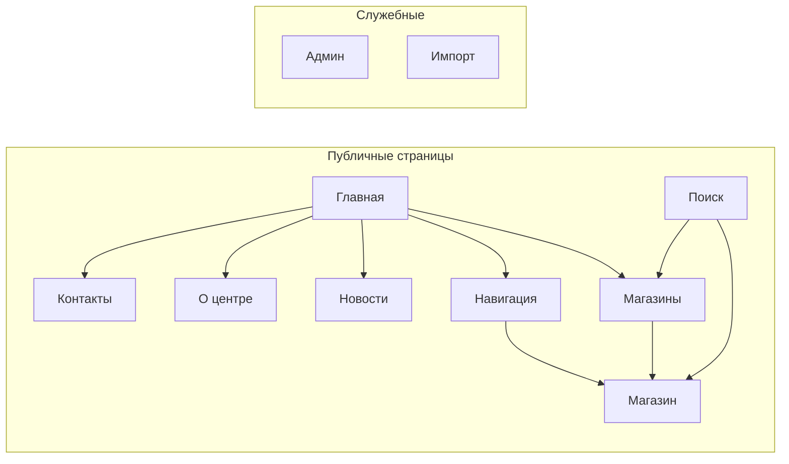

# Схемы для Microsoft Visio — ТРЦ «Европа 27»

Инструкция по созданию схем в Microsoft Visio: **Структура проекта**, **Структура сайта**, **Интерфейс проекта**.

---

## Готовые файлы (Draw.io → Visio)

Файлы можно открыть в [app.diagrams.net](https://app.diagrams.net), отредактировать и экспортировать в Visio:

| Файл | Описание |
|------|----------|
| `docs/structure-site.drawio` | Структура сайта (страницы, навигация) |
| `docs/structure-files.drawio` | Структура файлов проекта (папки и подписи к ним) |

**Файл → Экспортировать как → VSDX (Visio)**

---

## 1. Схема «Структура проекта»

### Назначение
Показать иерархию файлов и папок проекта, а также связь компонентов.

### Элементы для диаграммы

Используйте **блок-схему** или **блок-диаграмму** в Visio. Создайте иерархию:

```
ТРЦ Европа 27 (корень проекта)
├── admin/              — Административная панель
│   └── index.php       
├── assets/             — Статические ресурсы
│   ├── css/
│   │   └── style.css   
│   ├── js/
│   │   └── main.js     
│   └── images/
│       └── shops/      — Изображения магазинов
├── config/             — Конфигурация
│   ├── config.php      — Настройки (БД, сайт, пароль)
│   └── database.php   — Подключение к БД (PDO)
├── database/           — Схема и скрипты БД
│   ├── schema.sql      — Создание таблиц
│   ├── seed_news.sql   — Начальные новости
│   └── migrate_2_floors.sql
├── import/             — Импорт данных
│   ├── data.json       — Исходные данные
│   └── run.php         — Скрипт импорта
├── includes/
│   └── shop_icons.php  — Функции изображений магазинов
├── presentation/       — Презентация проекта
│   └── index.html      — Reveal.js
├── src/                — Модели (бизнес-логика)
│   ├── Shop.php        
│   ├── Category.php    
│   ├── Floor.php       
│   ├── News.php        
│   ├── SearchEngine.php
│   ├── DataImporter.php
│   └── MorphyProcessor.php
├── views/              — Шаблоны страниц (PHP)
│   ├── layout.php      — Общий макет
│   ├── home.php        
│   ├── shops.php       
│   ├── shop.php        
│   ├── search.php      
│   ├── floors.php      
│   ├── news.php        
│   ├── about.php       
│   ├── contacts.php    
│   └── 404.php         
├── index.php           — Точка входа, маршрутизация
├── bootstrap.php       — Инициализация, DI-контейнер
├── install.php         — Установка БД
├── autoload.php        — Загрузчик классов
└── composer.json       
```

### Рекомендуемое оформление в Visio

**Стиль «папка → подпись»** (как на образце): прямоугольники для папок/файлов, стрелки к закруглённым прямоугольникам с описанием назначения.

| Элемент        | Тип фигуры | Цвет / замечание                         |
|----------------|------------|-----------------------------------------|
| Корень         | Прямоугольник | Основной цвет (синий/серый)         |
| Папки          | Прямоугольник | Светло-серый                         |
| Подписи        | Прямоугольник закруглённый | Жёлтый/кремовый       |
| PHP-файлы      | Прямоугольник | Фиолетовый/серый                     |
| Связи          | Стрелки     | От корня к дочерним, от папки к подписи  |

### Дополнительный блок: архитектура компонентов

Отдельная область диаграммы — связь компонентов:

```
[Браузер] → [index.php] → [bootstrap.php]
                ↓
         [Модели: Shop, Category, Floor, News, SearchEngine]
                ↓
         [config/database.php] → [MySQL/MariaDB]
                ↓
         [views/layout.php] + [views/{page}.php]
                ↓
         [HTML + CSS + JS]
```

---

## 2. Схема «Структура сайта»

Подробная пошаговая инструкция — в файле **`docs/structure-site-visio.md`**.

Кратко: главная страница в центре сверху, от неё — 6 основных разделов (Магазины, Навигация, Новости, О центре, Контакты, Поиск), далее — страница магазина (от Магазины, Навигации, Поиска), служебные (Админ, Импорт) пунктирными стрелками.

---

## 3. Схема «Интерфейс проекта»

### Назначение
Показать структуру пользовательского интерфейса: страницы, навигацию и переходы между ними.

### Карта страниц (навигационная структура)

```
                    ┌─────────────────┐
                    │     ГЛАВНАЯ     │
                    │   (index.php)   │
                    └────────┬────────┘
                             │
     ┌──────────┬────────────┼────────────┬──────────┐
     │          │            │            │          │
     ▼          ▼            ▼            ▼          ▼
┌─────────┐ ┌─────────┐ ┌─────────┐ ┌─────────┐ ┌─────────┐
│Магазины │ │Навигация│ │Новости  │ │О центре │ │Контакты │
│ (shops) │ │(floors) │ │ (news)  │ │(about)  │ │(contacts)│
└────┬────┘ └────┬────┘ └─────────┘ └─────────┘ └─────────┘
     │           │
     │           └────── Магазины по этажам
     │
     ▼
┌─────────────┐      ┌─────────────┐
│Страница     │      │   ПОИСК     │
│магазина     │◄─────│  (search)   │
│(shop?id=N)  │      └──────┬──────┘
└─────────────┘             │
                            │ Ввод запроса
                            ▼
                     Результаты поиска
                     (магазины + товары)

Отдельные разделы (без основной навигации):
┌─────────────┐      ┌─────────────┐
│   Админ     │      │   Импорт    │
│  (admin)    │      │  (import)   │
└─────────────┘      └─────────────┘
```

### Описание экранов

| Страница   | URL                    | Содержимое |
|------------|------------------------|------------|
| **Главная**| `index.php`            | Статистика, категории, превью магазинов, блок новостей, CTA |
| **Магазины** | `?page=shops`        | Каталог карточек, фильтры по категории и этажу |
| **Магазин** | `?page=shop&id=N`     | Изображение, описание, товары/услуги по вкладкам |
| **Навигация** | `?page=floors`      | Этажи, списки магазинов по этажам |
| **Новости** | `?page=news`         | Лента новостей и акций |
| **О центре** | `?page=about`        | Информация о ТРЦ, статистика |
| **Контакты** | `?page=contacts`     | Адрес, режим работы, телефон |
| **Поиск**  | `?page=search&q=...`  | Поле ввода, результаты (магазины и товары) |
| **Админ**  | `?page=admin`         | Форма входа, управление контентом |
| **Импорт** | `?page=import`        | Загрузка данных из JSON |

### Структура общего макета (layout)

```
┌─────────────────────────────────────────────────────────────┐
│ HEADER                                                      │
│  [Логотип]  [Поиск: поле + кнопка "Найти"]  [Навигация]    │
│  Главная | Магазины | Навигация | Новости | О центре | ...  │
└─────────────────────────────────────────────────────────────┘
┌─────────────────────────────────────────────────────────────┐
│ MAIN (контент страницы)                                      │
│                                                              │
│   [hero / breadcrumb / заголовок]                            │
│   [контент: сетка карточек / текст / форма]                  │
│                                                              │
└─────────────────────────────────────────────────────────────┘
┌─────────────────────────────────────────────────────────────┐
│ FOOTER                                                       │
│  [Название] [Ссылки] [Режим работы] [Телефон]                 │
└─────────────────────────────────────────────────────────────┘
```

### Рекомендуемое оформление в Visio

- Используйте **блок-схему** или **карту сайта** (Site Map).
- Каждая страница — прямоугольник с названием и кратким описанием.
- Стрелки показывают переходы (клики по ссылкам).
- Группируйте страницы: «Публичные», «Служебные».
- Отдельным блоком изобразите структуру header / main / footer.

---

## 4. Mermaid-диаграммы (альтернатива)

Ниже приведены диаграммы в формате Mermaid. Их можно:
- отобразить в GitHub/GitLab;
- сконвертировать в PNG на [mermaid.live](https://mermaid.live);
- использовать как образец для Visio.

### Структура проекта (Mermaid)



### Интерфейс проекта (Mermaid)



---

## Экспорт в изображения

1. **Mermaid Live Editor**: https://mermaid.live — вставьте код, нажмите «Export» → PNG/SVG.
2. **Draw.io**: бесплатный аналог Visio — https://app.diagrams.net — можно создать схемы по этой спецификации.
3. **Visio**: создайте новую диаграмму, выберите шаблон «Блок-схема» или «Карта сайта», перенесите элементы по описанию выше.
